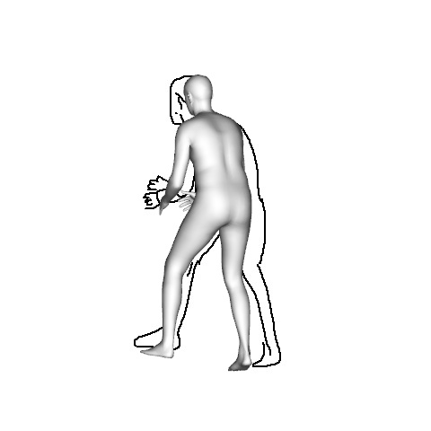

## 人体手绘草图----->三维模型
ubuntu18.04 
torch
## example
### 输入：

### 输出：

## web应用

运行 **draw_server.py**

配置 ./OBJViewer-master/js/OBJLoader.js 的 **ip**

安装 **anywhere**

`cd OBJViewer-master`

`anywhere`
