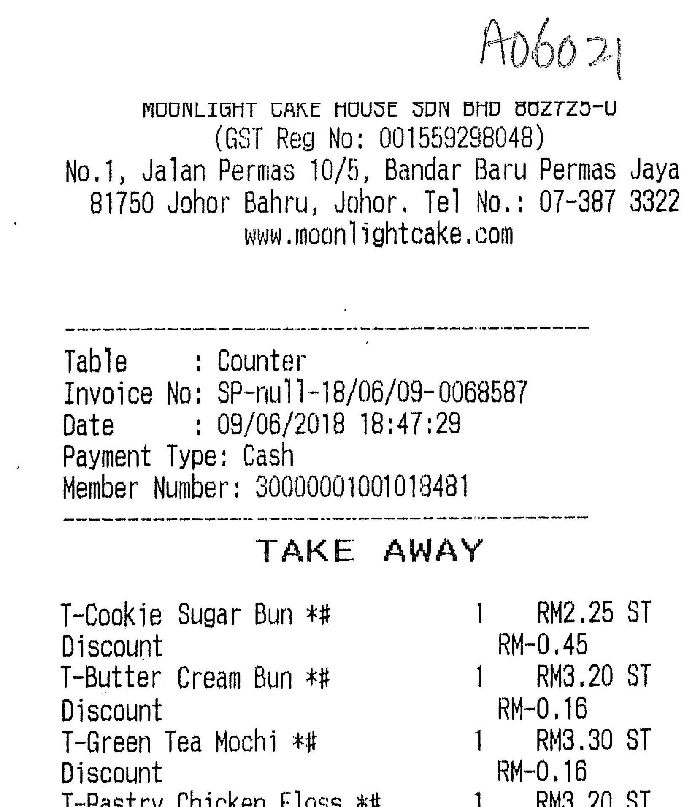
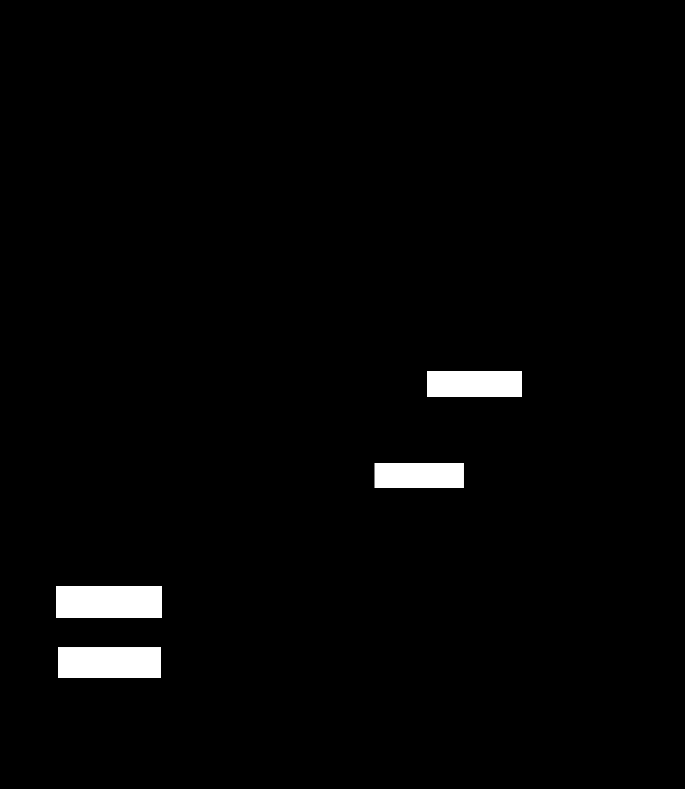

# original net：https://github.com/mouse1998mouse/RRunet
#将证书中的串改位置进行掩码标记，示例如下
## 输入

## 效果

## 依赖
- Python 3.6 +
- PyTorch 1.0 +
- cudatoolkit 10.0 +
- mmcv

## 运行
 - './model_seg/*': it includes detailed implementations of 'ConvNext', 'Swin', 'uperHead'
 - 'train.py': you can use it to train your model
 - 'predict.py': you can use it to test
 ##
